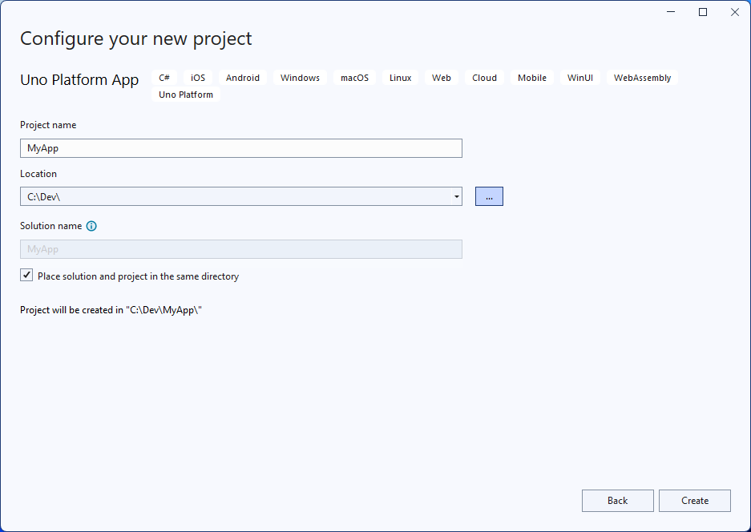
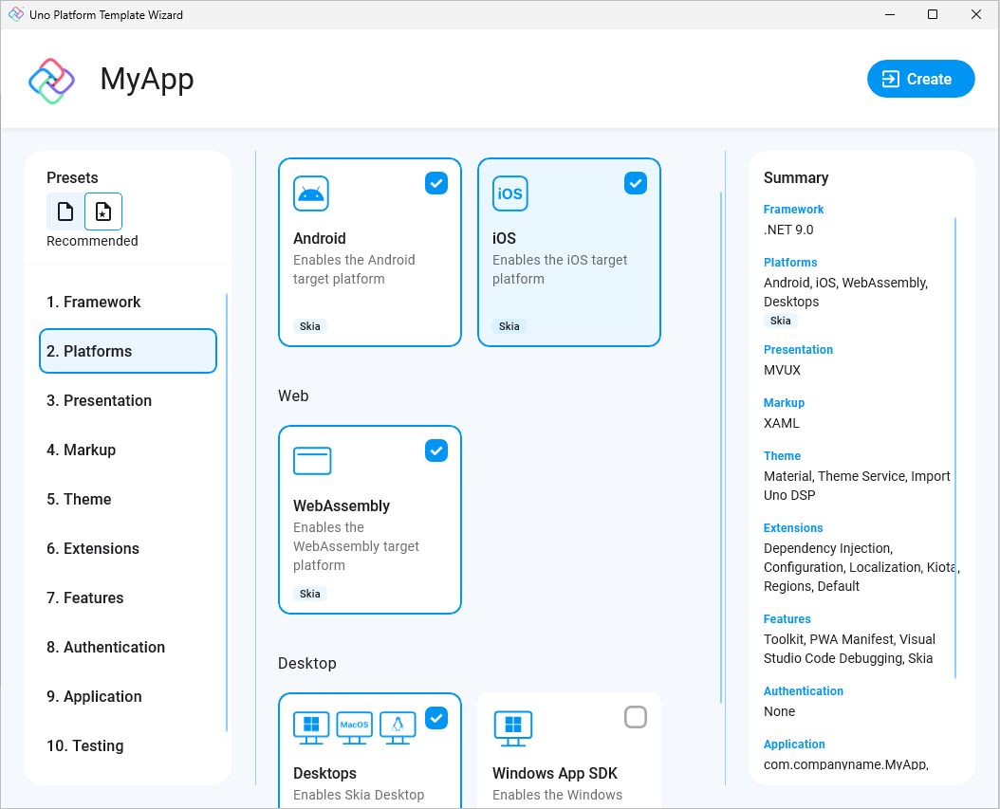
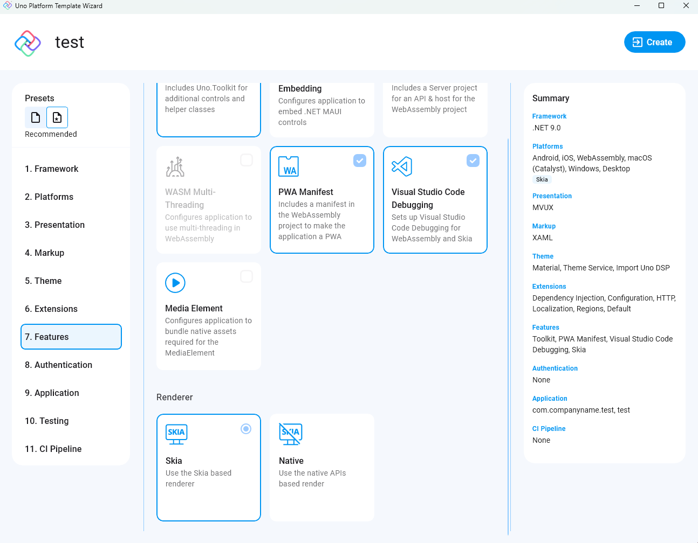
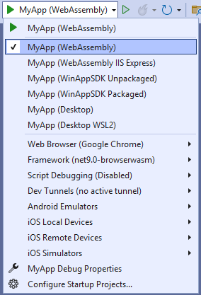
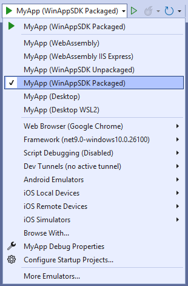
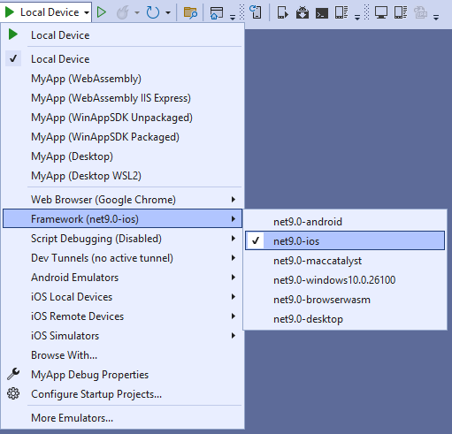
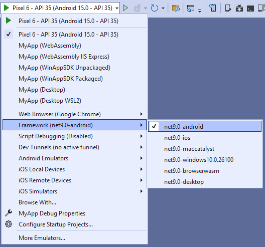

# Creating an app with Visual Studio 2022 for Windows

> [!NOTE]
> Make sure to setup your environment first by [following our instructions](xref:Uno.GetStarted.vs2022).

## Create the App

To create an Uno Platform app:

1. Create a new C# solution using the **Uno Platform App** template, from Visual Studio's **Start Page**, then click the **Next** button

      
    

1. Configure your new project by providing a project name and a location, check the "**Place solution and project in the same directory**" option, then click the **Create** button

    

1. Choose a template preset to build your application

    

    > [!TIP]
    > For a detailed overview of the Uno Platform project template wizard and all its options, see [this](xref:Uno.GettingStarted.UsingWizard).

    > [!NOTE]
    > Skia rendering is now the default rendering engine in Uno Platform templates. If you prefer native rendering instead, you can switch this setting in the `Features` tab under `Renderer`.

    

1. Click the create button

1. Ensure that the lower left IDE icon shows a check mark and says "Ready" . This ensures that the projects have been created, and their dependencies have been restored completely.

1. A Windows Firewall window may appear. If you do not intend to do Linux development with WSL, check "Private networks" only. Otherwise, check "Public networks" and "Private networks".

1. A banner at the top of the editor may ask to reload projects, click **Reload projects**:  
    

1. > [!IMPORTANT]
    > A notification should appear prompting you to sign in or register with Uno Platform.
    >
    > Signing in with your Uno Platform account in Visual Studio unlocks powerful tools like Hot Reload, helping you speed up development.
    >
    > With a single registration, you also gain early access to new features and the opportunity to connect with the Uno Platform community, where you can share feedback and network.
    >
    > Detailed information on registration and sign-in is available <a href="https://aka.platform.uno/account-access" target="_blank">here</a>.
    >
    > 

## Debug the App

### [**Desktop**](#tab/desktop)

To debug your Uno Platform **Desktop** target:

- Directly on Windows:
  - In the **Debug toolbar** drop-down, select the profile `MyApp (Desktop)`

    

  - Press `F5` to debug.

- Using WSL with X11:
  - In the **Debug toolbar** drop-down, select the profile `MyApp (Desktop WSL2)`

    

  - Then press `F5` or the green arrow to start debugging the app

### [**WebAssembly**](#tab/wasm)

To run the **WebAssembly** (Wasm) head:

- In the debugger toolbar, click the down arrow to select **MyApp (WebAssembly)**

    

- Press the `MyApp (WebAssembly)` button to deploy the app
- To run/debug your WebAssembly app on a mobile device, you can utilize the Dev Tunnels feature of Visual Studio 2022 (see [Microsoft Learn documentation](https://learn.microsoft.com/aspnet/core/test/dev-tunnels) to get started)

### [**ASP.NET Hosted WebAssembly**](#tab/wasm-hosted)

To run the ASP.NET Hosted **WebAssembly** (Server) head, if you've selected the option in the Wizard:

- Right-click on the `MyApp.Server` project, select **Set as startup project**
- Press the `MyApp.Server` button to deploy the app

### [**Windows**](#tab/windows)

To run the **Windows** (WinAppSDK) head:

- In the debugger toolbar, click the down arrow to select **MyApp (WinAppSDK Packaged)** or **MyApp (WinAppSDK Unpackaged)**

    

- Press the `MyApp (WinAppSDK Packaged)` or `MyApp (WinAppSDK Unpackaged)` button to deploy the app
- If you have not enabled Developer Mode, the Settings app should open to the appropriate page. Turn on Developer Mode and accept the disclaimer.

> [!NOTE]
> If you're not able or willing to turn on the Windows developer mode, [read about this common issue](xref:Uno.UI.CommonIssues.vs2022#unable-to-select-the-myapp-unpackaged-winappsdk-profile).

### [**iOS**](#tab/iOS)

To debug for **iOS**:

> [!NOTE]
> For information about connecting Visual Studio to a Mac build host to build iOS apps, see [Pairing to a Mac for .NET iOS development](https://learn.microsoft.com/xamarin/ios/get-started/installation/windows/connecting-to-mac/). Catalyst apps are not supported in Visual Studio 2022 on Windows, you can use [VS Code Remote SSH](xref:Uno.GetStarted.vscode) to enable this scenario.

- In the "Debug toolbar" drop-down, select framework `net9.0-ios`:

    

- Select:
  - An active device, if your IDE is connected to a macOS Host
  - A [local device using Hot Restart](https://learn.microsoft.com/xamarin/xamarin-forms/deploy-test/hot-restart), to debug your application without connecting to a mac

    > [!NOTE]
    > If no iOS devices are available, a Visual Studio 17.7+ issue may require unloading/reloading the project. Right-click on the `MyApp` project and select **Unload Project** then **Load project**.
    > [!IMPORTANT]
    > When using a device connected to a Windows PC, the Release build configuration is not supported. An actual macOS machine is required.

### [**Android**](#tab/Android)

To debug the **Android** platform:

- In the **Debug toolbar** drop-down, select framework `net9.0-android`

    

- Select an active device in the "Device" sub-menu
    > [!NOTE]
    > If no android devices are available, a Visual Studio 17.7+ issue may require unloading/reloading the project. Right-click on the `MyApp` project and select **Unload Project** then **Load project**.

---

You're all set!

## Next Steps

Now that you're Created and Debug the App.

Learn more about:

- [Uno Platform features and architecture](xref:Uno.GetStarted.Explore)
- [Hot Reload feature](xref:Uno.Features.HotReload)
- [Uno Platform App solution structure](xref:Uno.Development.AppStructure)
- [Troubleshooting](xref:Uno.UI.CommonIssues)
- [How-tos and Tutorials](xref:Uno.Tutorials.Intro) See real-world examples with working code.
- [List of views implemented in Uno](implemented-views.md) for the set of available controls and their properties.
