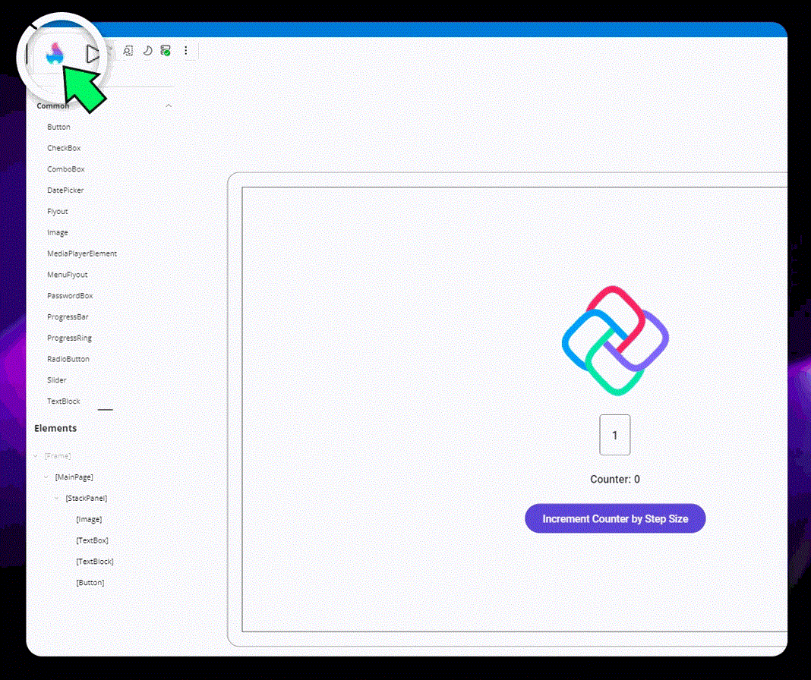

<!-- markdownlint-disable MD026 -->
# Welcome to Uno Platform! Important Next Steps

Create a simple cross-platform Counter application. (Time to complete < 5 min)

<!-- markdownlint-disable MD001 -->

<!-- Centered first item -->

<a href="studio/Hot Design/hot-design-getstarted-counter-tutorial.md">

#### Hot Design®

Use Hot Design®, Uno Platform's visual designer, to design and develop the app.

</a>

Prefer to start from code? Choose one of the 4 variants of the Counter tutorial, combining markup language (XAML or C# Markup) and presentation framework (MVVM or MVUX).

<a href="getting-started/counterapp/get-started-counter-xaml-mvux.md">

#### XAML + MVUX

Use XAML for layout and MVUX for state management

</a>

<a href="getting-started/counterapp/get-started-counter-xaml-mvvm.md">

#### XAML + MVVM

Use XAML for layout and MVVM for state management

</a>

<a href="getting-started/counterapp/get-started-counter-csharp-mvux.md">

#### C# Markup + MVUX

Use C# Markup for layout and MVUX for state management

</a>

<a href="getting-started/counterapp/get-started-counter-csharp-mvvm.md">

#### C# Markup + MVVM

Use C# Markup for layout and MVVM for state management

</a>

 

[!include[getting-help](includes/getting-help.md)]
